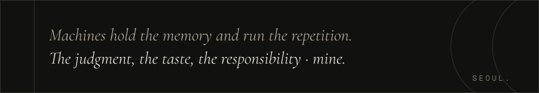

Composes and teaches music at Esther Music Academy in Hongdae, Seoul, and studies sound as an M.A. student at MARTE, Dongguk University. Not a developer by training: directs AI agents (Claude Code, Codex CLI) to build the tools that sound, teaching and research actually need, rather than writing most of the code by hand. The stack that runs the day stays private, a set of hubs for skills and session memory, agent orchestration, finance, and foreign-language reading.

**〈Dystopia · Dissolved Sounds〉** · a sound-art exhibition · [dissolvedsound.com](https://dissolvedsound.com) 
**[seeingsound-listningemage2026](https://github.com/yulflow/seeingsound-listningemage2026)** · Seeing Sound, Listening Image: 동국대 MARTE 대학원 전시 프로젝트 
**[esther-main](https://esther-main.vercel.app)** · the academy's site: vocal, piano, MIDI composition, entrance-exam prep 
**[esther-insta-assets](https://github.com/yulflow/esther-insta-assets)** · 에스더 실용음악학원 인스타그램 홍보물 에셋 
**[codexian](https://github.com/yulflow/codexian)** · Obsidian plugin that embeds OpenAI Codex as an AI collaborator in your vault (Claudian fork) 
**[quartz-notes](https://github.com/yulflow/quartz-notes)** · personal knowledge base · [live](https://quartz-notes-one.vercel.app) 
**[seoyulson-portfolio](https://github.com/yulflow/seoyulson-portfolio)** · portfolio site source · [live](https://seoyulson-portfolio.vercel.app)

**Build** · TypeScript, Next.js, React, Tailwind CSS, Supabase, Vercel, Cloudflare 
**Direct** · Claude Code, Codex CLI, MCP servers, Ollama and MLX on local Apple silicon 
**Make** · Logic Pro, Ableton Live, Cubase, Max/MSP, TouchDesigner, three.js, Blender, Figma

More at **[seoyulson.com](https://seoyulson.com)**.

